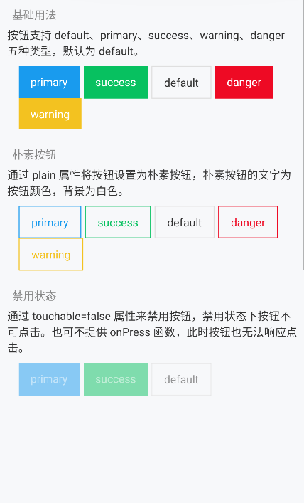
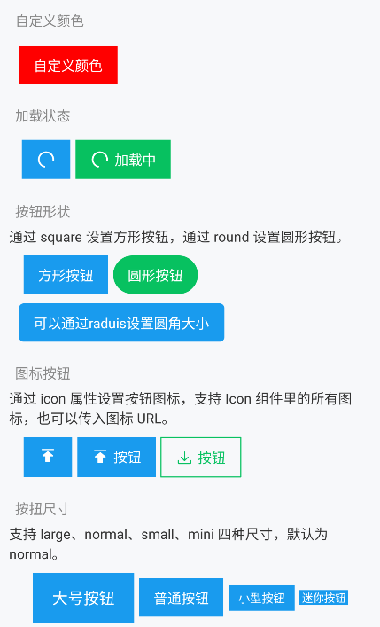

# Button 按钮

## 介绍

按钮用于触发一个操作，如提交表单。




## 基础用法

按钮支持 default、primary、success、warning、danger 五种类型，默认为 default。

```jsx
<RowView wrap style={{ padding: 10 }}>
  <Button text="primary" type="primary" onPress={()=>console.log('点击了！')} style={{ marginLeft: 5 }} />
  <Button text="success" type="success" onPress={()=>console.log('点击了！')} style={{ marginLeft: 5 }} />
  <Button text="default" type="default" onPress={()=>console.log('点击了！')} style={{ marginLeft: 5 }} />
  <Button text="danger" type="danger" onPress={()=>console.log('点击了！')} style={{ marginLeft: 5 }} />
  <Button text="warning" type="warning" onPress={()=>console.log('点击了！')} style={{ marginLeft: 5 }} />
</RowView>
```

关于他们的主题颜色修改，可参考 [主题与颜色](../introduction/theme.md#颜色) 。

## 朴素按钮

通过 plain 属性将按钮设置为朴素按钮，朴素按钮的文字为按钮颜色，背景为白色。

```jsx
<RowView wrap style={{ padding: 10 }}>
  <Button plain text="primary" type="primary" onPress={()=>console.log('点击了！')} style={{ marginLeft: 5 }} />
  <Button plain text="success" type="success" onPress={()=>console.log('点击了！')} style={{ marginLeft: 5 }} />
  <Button plain text="default" type="default" onPress={()=>console.log('点击了！')} style={{ marginLeft: 5 }} />
  <Button plain text="danger" type="danger" onPress={()=>console.log('点击了！')} style={{ marginLeft: 5 }} />
  <Button plain text="warning" type="warning" onPress={()=>console.log('点击了！')} style={{ marginLeft: 5 }} />
</RowView>
```

## 禁用状态

通过 touchable=false 属性来禁用按钮，禁用状态下按钮不可点击。

也可不提供 onPress 函数，此时按钮也无法响应点击。

```jsx
<RowView wrap style={{ padding: 10 }}>
  <Button touchable={false} text="primary" type="primary" style={{ marginLeft: 5 }} />
  <Button touchable={false} text="success" type="success" style={{ marginLeft: 5 }} />
  <Button touchable={false} text="default" type="default" style={{ marginLeft: 5 }} />
</RowView>
```

## 自定义颜色

```jsx
<RowView wrap style={{ padding: 10 }}>
  <Button text="自定义颜色" type="custom" color="#f00" pressedColor="#ff0" textColor="#fff" onPress={()=>console.log('点击了！')} />
</RowView>
```

## 加载状态

```jsx
<RowView wrap style={{ padding: 10 }}>
  <Button loading={true} type="primary" icon="top-filling" onPress={()=>console.log('点击了！')} style={{ marginLeft: 5 }} />
  <Button loading={true} loadingText="加载中" type="success" onPress={()=>console.log('点击了！')} style={{ marginLeft: 5 }} />
</RowView>
```

## 按钮形状

通过 square 设置方形按钮，通过 round 设置圆形按钮。

```jsx
<RowView wrap style={{ padding: 10 }}>
  <Button shape="square" text="方形按钮" type="primary" onPress={()=>console.log('点击了！')} style={{ marginLeft: 5 }} />
  <Button shape="round" text="圆形按钮" type="success" onPress={()=>console.log('点击了！')} style={{ marginLeft: 5 }} />
  <Button shape="round" radius={5} text="可以通过raduis设置圆角大小" type="primary" onPress={()=>console.log('点击了！')} style={{ marginTop: 10 }} />
</RowView>
```

## 自定义颜色

通过 icon 属性设置按钮图标，支持 Icon 组件里的所有图标，也可以传入图标 URL。

```jsx
<RowView wrap style={{ padding: 10 }}>
  <Button icon="top-filling" type="primary" onPress={()=>console.log('点击了！')} style={{ marginLeft: 5 }} />
  <Button icon={require('/images/test.png')} text="按钮" type="primary" onPress={()=>console.log('点击了！')} style={{ marginLeft: 5 }} />
  <Button icon="download" plain text="按钮" type="success" onPress={()=>console.log('点击了！')} style={{ marginLeft: 5 }} />
</RowView>
```

## 按扭尺寸

支持 large、normal、small、mini 四种尺寸，默认为 normal。

```jsx
<RowView wrap center style={{ padding: 10 }}>
  <Button text="大号按钮" type="primary" size="large" onPress={()=>console.log('点击了！')} />
  <Button text="普通按钮" type="primary" size="medium" onPress={()=>console.log('点击了！')} style={{ marginLeft: 5 }} />
  <Button text="小型按钮" type="primary" size="small" onPress={()=>console.log('点击了！')} style={{ marginLeft: 5 }} />
  <Button text="迷你按钮" type="primary" size="mini" onPress={()=>console.log('点击了！')} style={{ marginLeft: 5 }} />
</RowView>
```

关于按钮尺寸的预设边距，你可以通过 `SpaceDefines.button_pv_large`、`SpaceDefines.button_ph_large` 等等预设 来修改。

## API 参考

|参数|说明|类型|默认值|
|---|---|---|---|
|text|按钮文字(同children)|string|-|
|children|按钮文字|string|-|
|type|按钮支持 default、primary、success、warning、danger、custom 自定义 六种类型|`ButtomType`|`default`|
|block|占满父级主轴|string|`false`|
|plain|通过 plain 属性将按钮设置为朴素按钮，朴素按钮的文字为按钮颜色，背景为白色。|string|`false`|
|loading|通过 loading 属性设置按钮为加载状态，加载状态下默认会隐藏按钮文字，可以通过 loadingText 设置加载状态下的文字。|boolean|`false`|
|loadingText|加载状态下的文字。|string|-|
|loadingColor|加载状态圆圈颜色|ThemeColor|-|
|shape|按钮形状 通过 square 设置方形按钮，通过 round 设置圆形按钮。|`'square'`&#124;`'round'`|`square`|
|icon|左侧图标。支持 IconFont 组件里的所有图标，也可以传入图标的图片 URL（http/https）。|`string`,`ImageSourcePropType`|-|
|text|按钮文字|string|-|
|touchable|是否可以点击|boolean|`true`|
|radius|当按扭为round圆形按扭时的圆角大小|number|`normal`|
|color|自定义按钮的背景颜色|ThemeColor|-|
|textColor|按钮文字的颜色|ThemeColor|-|
|textStyle|按钮文字的样式|TextStyle|-|
|pressedColor|按下时的颜色，仅在 type 为 `custom` 时有效|ThemeColor|-|
|disabledColor|禁用时的颜色，仅在 type 为 `custom` 时有效|ThemeColor|-|
|style|自定义样式|ViewStyle|-|
|padding|强制控制按钮的边距。如果是数字，则设置所有方向边距；两位数组 [vetical,horizontal]；四位数组 [top,right,bottom,left]|`number`&#124;`number[]`|-|
|viewProps|外层容器参数|ViewProps|-|
|renderIcon|自定义图标渲染|`(isLeft: boolean, name: string&#124;ImageSourcePropType&#124;undefined) => JSX.Element`|-|
|onPress|点击事件|`() => void`|-|
