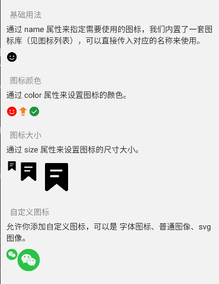
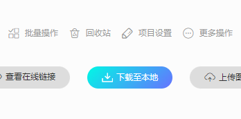
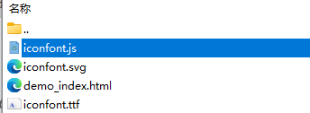

# Icon 图标

## 介绍

图标包装组件，语义化的矢量图形。

Icon 支持基于字体的图标集、Svg 图标、图片，你只需要预先通过 IconUtils.configIconMap 设置自己的图标集，即可通过 name 快速显示一个图标。



## 内置图标列表

[查看内置图标列表](https://imengyu.top/pages/imengyu-ui-lib/demo_index.html)

## 基础用法

通过 name 属性来指定需要使用的图标，我们内置了一套图标库（见图标列表），可以直接传入对应的名称来使用。

全部的内置图标名称见下方。

```jsx
<Icon icon="smile-filling" />
```

## 图标颜色

通过 color 属性来设置图标的颜色。

```jsx
<Icon icon="smile-filling" color="#ff0900" />
<Icon icon="rise-filling" color="#f58220" />
<Icon icon="success-filling" color="#1d953f" />
```

## 图标大小

通过 size 属性来设置图标的尺寸大小。

```jsx
<Icon icon="file-common-filling" size={20} />
<Icon icon="file-common-filling" size={40} />
<Icon icon="file-common-filling" size={60} />
```

## 自定义图标

允许你添加自定义图标，可以是 字体图标、普通图像、svg图像。

你需要先在组件初始化之前设置你的图标映射相关数据，此数据只需要注册一次即可：

```js
//添加自定义图标
IconUtils.configIconMap({
  //普通图片
  'custom1': { source: require('../images/wechart.png'), svg: false },
  //svg 文件
  'custom2': { source: require('../images/wechart.svg'), svg: true },
  //svg 文字
  'custom3': `<svg viewBox="0 0 1024 1024"><path d="M320 885.333333c-8.533333 0-17.066667-4.266667-23.466667-10.666666-12.8-12.8-10.666667-34.133333 2.133334-44.8L654.933333 512 298.666667 194.133333c-12.8-10.666667-14.933333-32-2.133334-44.8 10.666667-12.8 32-14.933333 44.8-2.133333l384 341.333333c6.4 6.4 10.666667 14.933333 10.666667 23.466667 0 8.533333-4.266667 17.066667-10.666667 23.466667l-384 341.333333c-6.4 6.4-12.8 8.533333-21.333333 8.533333z"  ></path></svg>`,
  //网络图片
  'custom4': 'https://imengyu.top/assets/images/test/2.jpg',
});

```

然后在组件中使用：

```jsx
<Icon icon="custom1" size={20} />
<Icon icon="custom2" size={40} />
```

## 引入 iconfont 图标

库允许你加载 iconfont 导出的图标，你可以方便的将 iconfont 图标库使用在项目中。

1. 你需要在 iconfont 网站上导出并下载你的图标。

    
2. 解压其中的 iconfont.js 文件

    
3. 使用命令行工具转换

    ```shell
    npx imengyu-tools iconfont 下载的js路径
    ```

4. 转换完成后会输出一个 iconfont.js.output.json 文件至源目录，请将其复制到你的项目中，并导入到 Icon 组件中：

    ```js
    IconUtils.configIconMap(require('你的路径/iconfont.js.output.json'));
    ```

5. 然后就可以在 Icon 组件中通过图标名称使用图标库了，图标的名称与你在 iconfont 项目上设置的 classname 相同。

## API 参考

|参数|说明|类型|默认值|
|---|---|---|---|
|icon|图标的名称|string|-|
|size|图标文字大小|number|-|
|color|图标文字颜色|ThemeColor|`Color.black`|
|style|图标文字样式，注意，不同图标会使用不同的组件呈现，所以样式类型不能弄错|`TextStyle&#124;ViewStyle&#124;ImageStyle`|-|
|svgProps|渲染Svg时使用的额外属性，具体请参考 react-native-svg 的配置|`SvgProps`|-|
|imageProps|渲染Image时使用的额外属性|`ImageProps`|-|
|fontFamily|图标文字字体类名|`string`|`'iconfont'`|
