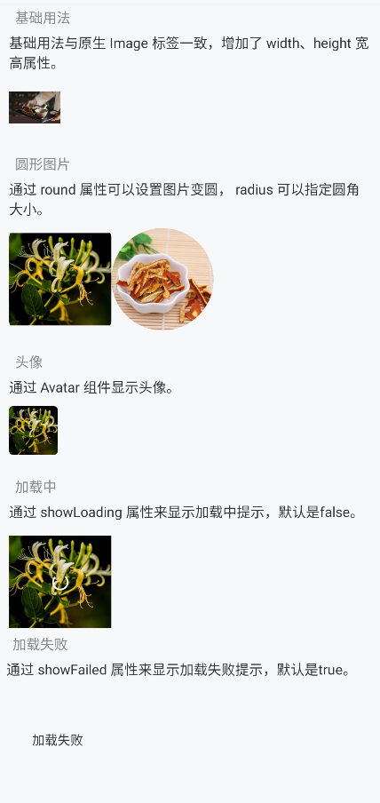

# Image 图片

## 介绍

图片包装组件。为图片增加了一些属性以方便使用。



## 基础用法

基础用法与原生 Image 标签一致，增加了 width、height 宽高属性。

```jsx
<Image source={{ uri: "https://imengyu.top/assets/images/test/1.jpg" }} width={rpx(100)} height={rpx(100)} />
```

## 圆形图片

通过 round 属性可以设置图片变圆， radius 可以指定圆角大小。

```jsx
<Image source={{ uri: "https://imengyu.top/assets/images/test/2.jpg" }} round radius={10} width={rpx(200)} height={rpx(200)} />
<Image source={{ uri: "https://imengyu.top/assets/images/test/3.jpg" }} round width={rpx(200)} height={rpx(200)} />
```

## 点击与长按

可以为图片增加 touchable 属性，以响应用户的点击和长按事件。

通常用于图片长按保存。

```jsx
<Image source={{ uri: "https://imengyu.top/assets/images/test/2.jpg" }} touchable={true} onPress={() => console.log('点击了！')} width={rpx(200)} height={rpx(200)} />
<Image source={{ uri: "https://imengyu.top/assets/images/test/3.jpg" }} touchable={true} onLongPress={() => console.log('长按了！')} width={rpx(200)} height={rpx(200)} />
```

## 加载中

通过 showLoading 属性来显示加载中提示，默认是false。

```jsx
<Image source={{ uri: "https://imengyu.top/assets/images/test/2.jpg" }} showLoading loading width={rpx(200)} height={rpx(200)} />
```

## 加载失败

通过 showFailed 属性来显示加载失败提示，默认是true。

```jsx
<Image source={{ uri: "https://imengyu.top/assets/images/test2/2.jpg" }} showLoading width={rpx(200)} height={rpx(200)} />
```

## API 参考

|参数|说明|类型|默认值|
|---|---|---|---|
|source|图片|ImageSourcePropType|-|
|failedSource|失败时显示图片|ImageSourcePropType|-|
|style|特殊样式|string|-|
|width|图片高度|`string&#124;number`|-|
|height|图片宽度|`string&#124;number`|-|
|aspectRatio|aspectRatio|number|-|
|showLoading|是否显示加载中提示|boolean|`false`|
|showFailed|是否显示加载失败提示|boolean|`false`|
|showGrey|是否显示灰色占位|boolean|`false`|
|loading|初始加载中状态|boolean|`false`|
|loadingColor|加载中圆圈颜色|ThemeColor|`Color.white`|
|touchable|指定图片是否可以点击|boolean|`false`|
|round|图片是否有圆角|boolean|`false`|
|radius|当round为true的圆角大小，默认是图片宽度一半|number|-|
|onPress|图片点击事件|`() => void`|-|
|onPress|图片长按事件|`() => void`|-|
