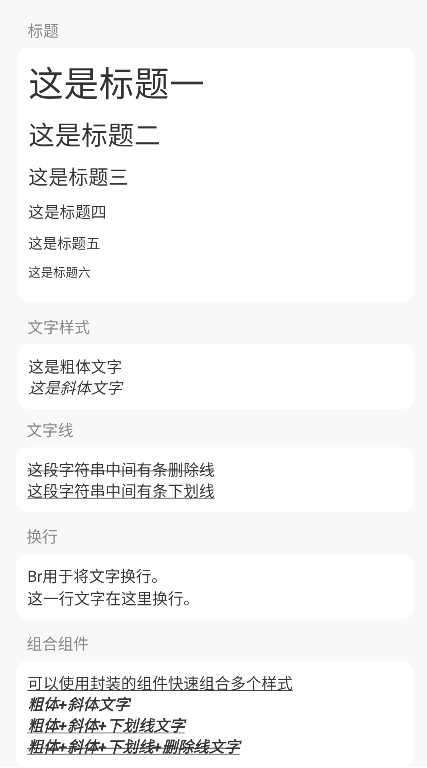

# Typography 排版

## 介绍

文本的基本格式。



## 标题

提供了类似 Html 的 H1~H6 标签，用于不同文本标题。标题样式中自带下边距和字号。

```jsx
<ColumnView padding={10}>
  <H1>这是标题一</H1>
  <H2>这是标题二</H2>
  <H3>这是标题三</H3>
  <H4>这是标题四</H4>
  <H5>这是标题五</H5>
  <H6>这是标题六</H6>
</ColumnView>
```

## 文字样式

`B` 加粗文字组件。类似于 HTML 中的 b 标签。

`I` 斜体文字组件。类似于 HTML 中的 i 标签。

```jsx
<ColumnView padding={10}>
  <B>这是粗体文字</B>
  <I>这是斜体文字</I>
</ColumnView>
```

## 文字线

`S` 删除线文字组件。类似于 HTML 中的 strike 标签。

`U` 下划线文字组件。类似于 HTML 中的 u 标签。

```jsx
<ColumnView padding={10}>
  <S>这段字符串中间有条删除线</S>
  <U>这段字符串有条下划线</U>
</ColumnView>
```

## 换行

```jsx
<ColumnView padding={10}>
  <Text>Br用于将文字换行。<Br />这一行文字在这里换行。</Text>
</ColumnView>
```

## 链接

下划线链接文字组件。类似于 HTML 中的 a 标签。

`A` 组件默认调用 `Linking.openURL` 打开链接，你也可以不提供 `href` 属性，使用 `onPress` 回调自由处理点击事件。

```jsx
<ColumnView padding={10}>
  <A href="https://www.bing.com">点击我打开 www.bing.com</A>
</ColumnView>
```

## 组合组件 Text

对Text组件做了一个封装。提供了一些方便开发的属性。

```jsx
<ColumnView padding={10}>
  <Text underline>可以使用封装的组件快速设置样式</Text>
  <Text color={Color.danger}>文字颜色</Text>
  <Text size={20}>文字大小</Text>
  <Text weight={"300"}>文字粗细</Text>

  <Text underline>可以使用封装的组件快速组合多个样式</Text>
  <Text bold italic>粗体+斜体文字</Text>
  <Text bold italic underline>粗体+斜体+下划线文字</Text>
  <Text bold italic underline lineThrough>粗体+斜体+下划线+删除线文字</Text>
</ColumnView>
```

## API 参考

### Text

|参数|说明|类型|默认值|
|---|---|---|---|
|size|字号，支持rpx|`number&#124;string`|-|
|backgroundColor|背景颜色x|`ThemeColor`|-|
|align|文字的 textAlign|`"auto"&#124;"left"&#124;"right"&#124;"center"&#124;"justify"&#124;undefined`|-|
|color|文字颜色|`ThemeColor`|`Color.text`|
|bold|是否是粗体(设置后weight属性无效)|`boolean`|-|
|weight|文字粗细|`"normal"&#124;"bold"&#124;"100"&#124;"200"&#124;"300"&#124;"400"&#124;"500"&#124;"600"&#124;"700"&#124;"800"&#124;"900"`|-|
|italic|是否是斜体|`boolean`|-|
|underline|是否加下划线|`boolean`|-|
|lineThrough|是否加删除线|`boolean`|-|
|autoSize|是否开启自动工具文字长短设置大小|`boolean`|-|
|autoSizeOption|自动工具文字长短设置大小，在 autoSize 为 true 时有效|`AutoSizeOption`|-|

#### AutoSizeOption

这个是一个小功能，目的是为了在某些情况下（例如金额显示），容器宽度一定但是文字长短不定，此时需要自动缩放大小，文字越长，字号越小。

计算公式是 (1 - (text.length - minLen) / (maxLen - minLen)) * (maxSize - minSize) + minSize

|参数|说明|类型|默认值|
|---|---|---|---|
|maxLen|最长文字长度，用于自动大小公式计算|`number`|-|
|minLen|最短文字长度，如果输入文字长度小于这个值，则不会进行自动缩放|`number`|-|
|maxSize|最大文字字号，用于自动大小公式计算|`number`|-|
|minSize|最小文字字号，用于自动大小公式计算|`number`|-|

### A

|参数|说明|类型|默认值|
|---|---|---|---|
|onPress|点击事件|`() => void`|-|
|href|链接, 如果提供，会调用 Link 打开链接|string|-|

### 其他组件

其他组件属性均继承于 Text，可以使用 Text 上的所有属性。
